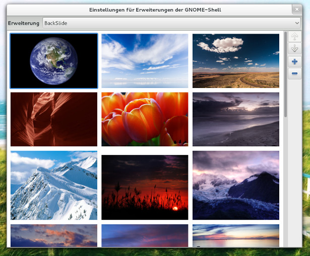

## Attention
This is a fork of original [BackSlide](https://gitlab.com/p91paul/BackSlide) extension with Gnome Shell 45 support

# BackSlide

A simple Gnome-Shell Extension for an automatic background-image (wallpaper) slideshow.

## Screenshots

The Widget:

The preferences page to manage the image list.

(Wallpapers **not** included)

## Installation

The extension should be installed from the official extension repository. It can be found here: 

### Manual installation

If you need to "install" the extension manually, you'll need the following utilities:

* `git`
* `glib-compile-schemas`
* `gnome-tweak-tool` (Optional)

The packages which include the above tools may vary across different Linux distributions. Check your distributions wiki/package list to find the most suitable package for you.

There are multiple stable branches, depending on the version of GnomeShell you're running. Check the `DEVELOPMENT.md`-file for information on those branches. To build the extension, follow these steps:

    :::bash
    # Clone the repository (you might already did this!)
    git clone https://gitlab.com/p91paul/BackSlide.git BackSlide
    cd BackSlide
      # EXAMPLE: Build for an older GnomeShell version
      git checkout gnome-3.8 # ONLY if you need to!
    # "Compile" the settings-schema:
    glib-compile-schemas backslide\@codeisland.org/schemas/
    # Copy the files over to the local extension directory:
    cp -r backslide\@codeisland.org/ ~/.local/share/gnome-shell/extensions/

Afterwards, you can activate the extension either by using the `gnome-tweak-tool` or at [extensions.gnome.org/local](https://extensions.gnome.org/local/)

## Settings

All settings can be changed from the `gnome-shell-extension-prefs`-tool or from the command line. Although you can set them using the `dconf`-tool, **using the frontend/widget is preferred!**.

* **Delay (in minutes) between wallpaper changes:** (*default*: `5`)

`dconf write /org/gnome/shell/extensions/backslide/delay 15`

* **Whether or not the wallpaper-list should be shuffled** (*default*: `true`)

`dconf write /org/gnome/shell/extensions/backslide/random true|false`

* **The List of wallpapers as a string-array of absolute, unix-styled path's:** (*default*: `[]`)

`dconf write /org/gnome/shell/extensions/backslide/image-list "['/path/to/picture.png', '/another/pic.png']"`

* **The already elapsed time (in minutes) from the last interval** (*default*: `0`)

`dconf write /org/gnome/shell/extensions/backslide/elapsed-time 0`

Settings changed, using the `dconf`-tool will **apply, after the extension is restarted**.

## Troubleshooting

### Changing background hangs/freezes the system

Some users have been experiencing short freezes while changing background. If it happens to you, try setting this gnome preference (see https://gitlab.com/p91paul/BackSlide/-/issues/68):

    gsettings set org.gnome.nautilus.desktop background-fade false

## Contribute

If you are a developer/translator and you want to contribute to BackSlide, make sure to read "DEVELOPMENT.md" or "TRANSLATION.md" respectively.
